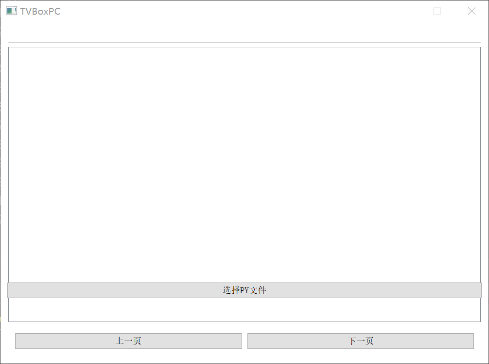

# TVBoxPC
### tvbox based pyqt5 , just a demo  
thanks to   
https://github.com/jaseg/python-mpv  
https://gitee.com/Mu-lnz/recommendation-system  
https://github.com/UndCover/Pyramid  
https://github.com/CatVodTVOfficial/TVBoxOSC  

*how to use*  
+ clone the repo.
+ install the python packages : pip install -r ./requirements.txt  
+ download the mpvlib at https://sourceforge.net/projects/mpv-player-windows/files/libmpv/ and put the libmpv-2.dll file to the project root dir.  
+ run main.py and select a py spider.

*what not work*
+ some m3u8 movies stored as image file are not supported by mpv player , see more infomations at https://gitee.com/xfangfang/Macast/issues/I4NMUR
this problem can be solved by replacing the player with aliplayer(https://help.aliyun.com/document_detail/51992.html) or potplayer
 
 *TODO*  
 + filter  
 + search
 + multithread
 + online config

